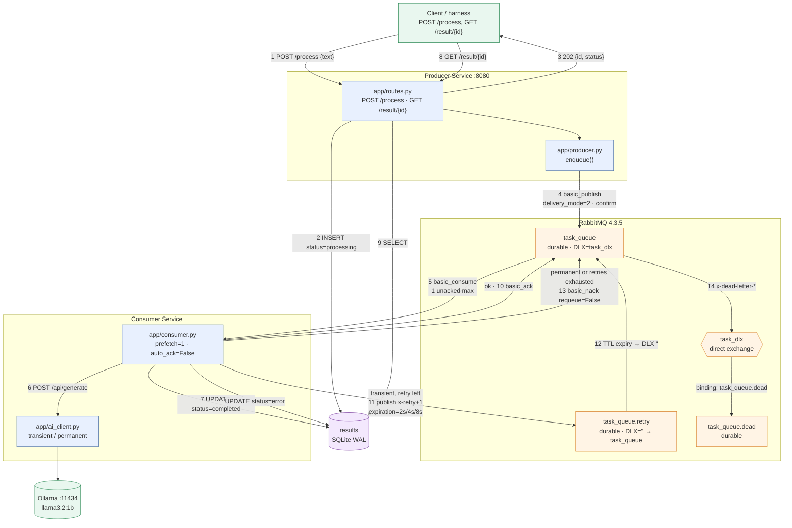
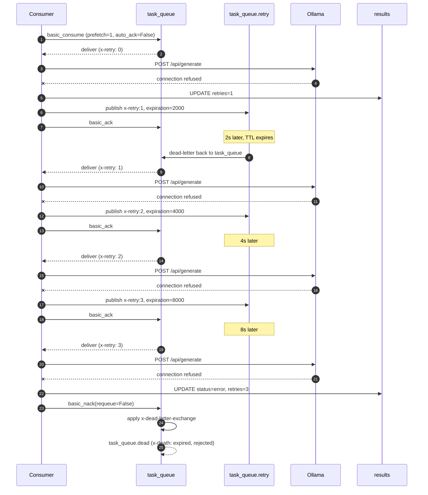

# Architecture

Two processes, one broker, one store. The producer service owns the HTTP
contract; the consumer service owns the work. They never call each other.

## Component diagram

## Message flow, happy path

1. `POST /process {"text": "..."}` arrives.
2. The producer writes a `processing` row **before** publishing, so an
   immediate `GET /result/{id}` can never 404.
3. It publishes to `task_queue` with `delivery_mode=2` and waits for a publisher
   confirm. Then it returns `202 {"id", "status", "created_at"}` in about
   0.7 s, without ever touching the AI.
4. The consumer receives the delivery. `prefetch_count=1` means at most one
   message is unacked at a time, so the depth shown in the management UI is a
   truthful count of outstanding work.
5. The consumer calls Ollama and writes `completed` plus the answer.
6. **Only then** does it `basic_ack`. Everything before this point is
   re-doable; the ack is the commit.
7. `GET /result/{id}` reads the row and returns the stored answer.

## Message flow, failure path

| Step | Trigger | Action |
|------|---------|--------|
| 1 | AI call fails, `x-retry` < 3 | Republish to `task_queue.retry` with `x-retry+1` and `expiration` = 2s / 4s / 8s, then `basic_ack` the original |
| 2 | Retry queue TTL expires | Broker dead-letters the copy back to `task_queue` through the default exchange |
| 3 | AI call fails, `x-retry` >= 3 | `basic_nack(requeue=False)`; the broker applies `task_queue`'s `x-dead-letter-exchange` |
| 4 | — | Message arrives in `task_queue.dead` with `x-death` recording both the `expired` and `rejected` hops |
| 5 | Malformed body | `basic_reject(requeue=False)` straight to the DLQ; no retries burned |

## Failure path, sequence

## Why the producer and consumer are separate processes

They are separate for one reason: **the consumer has to be killable.** Harness
criterion 2 and exercise 1.3 both require killing the consumer mid-message and
proving the work comes back. A consumer running as a background thread inside
the API process could not be killed without taking the API down with it, and its
in-memory state would be lost either way.

Separating them also means the result store cannot be a plain dict. The producer
must be able to answer `GET /result/{id}` for work the consumer is doing, across
a process boundary, which is why `store.py` exists at all.

## The equivalent draw.io source

`architecture.drawio` in this directory contains the same diagram as editable
draw.io XML. Open it at <https://app.diagrams.net> to edit or re-export.
